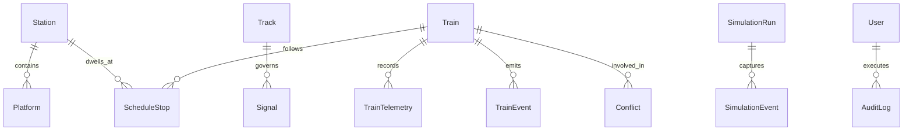

# Database Architecture & Relational Schema Documentation

The system persistence layer uses **SQLAlchemy 2.0 ORM** supporting both zero-configuration **SQLite 3** (local development and offline simulation) and enterprise **PostgreSQL 16** (production high-throughput telemetry).

---

## Entity Relationship Overview

The database comprises **21 core relational tables** organized into 6 operational domains:



---

## 1. Train Fleet & Operations Domain

### `trains`
Primary registry of rolling stock assets, static physical specifications, and live operational states.

| Column | Type | Constraints | Description |
|---|---|---|---|
| `id` | String(64) | Primary Key | Unique train identifier (e.g., `TRN_EXP_01`) |
| `train_number` | String(32) | Indexed, Unique | Official train operating schedule number |
| `name` | String(128)| Not Null | Human-readable service name (e.g., "Silver Arrow Express") |
| `train_type` | String(32) | Indexed | `INTERCITY`, `HIGH_SPEED`, `REGIONAL`, `FREIGHT`, `COMMUTER` |
| `origin_station_id` | String(64) | Foreign Key | Origin station reference |
| `destination_station_id` | String(64) | Foreign Key | Destination station reference |
| `length_m` | Float | Not Null | Physical length in meters (default 200.0m) |
| `weight_tons` | Float | Not Null | Total train gross weight (default 450.0t) |
| `max_speed_kmh` | Float | Not Null | Design maximum safe operational speed |
| `acceleration_ms2` | Float | Not Null | Maximum tractive acceleration capability ($0.8 \text{ m/s}^2$) |
| `braking_ms2` | Float | Not Null | Maximum service braking deceleration ($1.0 \text{ m/s}^2$) |
| `passenger_capacity` | Integer | Not Null | Maximum seated passenger capacity |
| `current_passengers` | Integer | Default 0 | Real-time passenger count onboard |
| `priority` | Integer | Indexed | Dispatching priority rank (1=Emergency, 10=Freight) |
| `status` | String(32) | Indexed | `RUNNING`, `STOPPED`, `DELAYED`, `MAINTENANCE`, `TERMINATED` |
| `current_speed_kmh` | Float | Default 0.0 | Live kinematic velocity |
| `current_track_id` | String(64) | Nullable | Current occupied block track segment |
| `current_lat` | Float | Nullable | Live GPS latitude coordinate |
| `current_lng` | Float | Nullable | Live GPS longitude coordinate |
| `current_delay_minutes` | Float | Default 0.0 | Deviation from scheduled timetable in minutes |
| `cumulative_energy_kwh` | Float | Default 0.0 | Total cumulative traction energy consumed |
| `regenerated_energy_kwh`| Float | Default 0.0 | Total energy recovered via electro-dynamic braking |

### `schedule_stops`
Station timetable sequencing, planned vs. actual arrival and departure timestamps.

| Column | Type | Description |
|---|---|---|
| `id` | Integer (PK) | Auto-increment identifier |
| `train_id` | String(64) (FK) | Reference to `trains.id` |
| `station_id` | String(64) (FK) | Reference to `stations.id` |
| `platform_id` | String(64) | Reference to assigned `platforms.id` |
| `stop_sequence` | Integer | Ordinal sequence along route |
| `scheduled_arrival` | DateTime | Timetabled arrival time |
| `scheduled_departure` | DateTime | Timetabled departure time |
| `actual_arrival` | DateTime | Recorded real-time arrival |
| `actual_departure` | DateTime | Recorded real-time departure |
| `dwell_duration_seconds` | Integer | Timetabled passenger transfer dwell window |

### `train_telemetry`
High-resolution time-series sensor readings recorded at 1 Hz for digital twin shadowing.

| Column | Type | Description |
|---|---|---|
| `id` | Integer (PK) | Auto-increment telemetry point ID |
| `train_id` | String(64) (FK) | Associated train |
| `timestamp` | DateTime (Indexed) | UTC sensor capture timestamp |
| `speed_kmh` | Float | Instantaneous speed |
| `latitude` | Float | Position latitude |
| `longitude` | Float | Position longitude |
| `power_draw_kw` | Float | Instantaneous electric draw |
| `current_delay_min`| Float | Instantaneous delay |

---

## 2. Infrastructure & Network Domain

- **`stations`**: Station identifiers, names, coordinates, zones, passenger holding capacities, operational status.
- **`platforms`**: Station platform numbers, lengths, catenary availability, occupancy flags, active train lock.
- **`tracks`**: Directed line segments, source/target station nodes, length (km), max speed, gradient, electrification flag, bidirectional support, status (`CLEAR`, `OCCUPIED`, `CLOSED`).
- **`junctions`**: Interlocking convergence points with rated throughput capacity.
- **`switches`**: Track turnouts with turnout positions (`NORMAL`, `REVERSE`), lock states, and reservation locks.
- **`signals`**: 4-aspect block signaling units (`GREEN`, `DOUBLE_YELLOW`, `YELLOW`, `RED`), location kilometer posts, and fault flags.
- **`maintenance`**: Scheduled track maintenance windows, speed restrictions, and work zones.
- **`weather_conditions`**: Real-time atmospheric conditions (rainfall, temperature, wind, rail adhesion factor).

---

## 3. Conflict & Optimization Domain

### `conflicts`
Records all spatial, temporal, and resource contentions detected by the real-time conflict arbiter.

| Column | Type | Description |
|---|---|---|
| `id` | String(64) (PK) | Unique conflict identifier |
| `conflict_type` | String(32) | `HEADWAY_VIOLATION`, `OPPOSITE_TRACK`, `JUNCTION_CONVERGENCE`, `PLATFORM_OVERLAP` |
| `severity` | String(16) | `CRITICAL`, `HIGH`, `MEDIUM`, `LOW` |
| `status` | String(16) | `ACTIVE`, `RESOLVED`, `IGNORED` |
| `primary_train_id` | String(64) | First train involved |
| `secondary_train_id` | String(64) | Second train involved (if collision/headway risk) |
| `detected_at` | DateTime | Arbiter detection timestamp |
| `predicted_time` | DateTime | Projected collision / deadlock timestamp |
| `cause` | Text | Human-readable root cause explanation |
| `recommended_action`| Text | Prescriptive dispatch recommendation |

### `optimization_runs`
Audit history of algorithmic routing, scheduling, dynamic rescheduling, and eco-driving runs.

---

## 4. AI Models & Audit Domain

- **`ai_model_registry`**: Catalogs all registered models (name, version, task, status, hyperparameters, metrics).
- **`prediction_logs`**: Inference audit records (model ID, inputs, predicted output, latency ms, confidence score).
- **`users`**: Dispatcher and operator accounts, hashed passwords (bcrypt), RBAC roles (`admin`, `dispatcher`, `analyst`).
- **`audit_logs`**: Tamper-evident trail of operational actions taken by human dispatchers or automated optimizers.

---

## 5. Migration & Production Seeding

To initialize or seed the database:

```bash
# Clean initialization and corridor network seeding
python scripts/seed_database.py
```
This provisions default stations, track infrastructure, signals, rolling stock, initial timetables, and pre-registers trained AI model cards.
